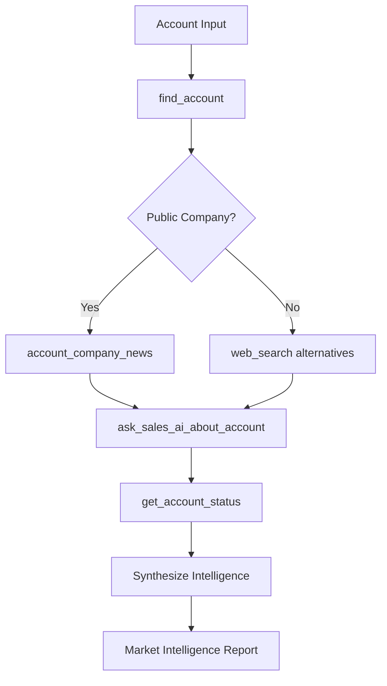

# SalesAI External Company News Agent

## Project Overview

Create an intelligent agent that leverages Backstory MCP tools to automatically gather, analyze, and synthesize external market intelligence for target accounts. This agent combines public company data, financial reports, and strategic insights to provide sales teams with comprehensive market intelligence.

## Required Tools & Dependencies

### Backstory MCP Tools
- `find_account` - Account discovery and basic information
- `account_company_news` - External news, public filings, and market events
- `ask_sales_ai_about_account` - AI-powered strategic analysis
- `get_account_status` - Internal relationship intelligence
- `get_recent_account_activity` - Communication history context

### Additional Tools
- `web_search` - Supplementary market research for private companies
- `web_fetch` - Deep-dive into specific reports/articles

## Agent Workflow Architecture



## Core Implementation

### 1. Account Discovery & Validation

```python
async def discover_account(account_name: str):
    """
    Step 1: Find and validate the target account
    Returns account metadata and determines research strategy
    """
    
    # Find the account in CRM
    account_data = await find_account(account_name=account_name)
    
    # Extract key information
    account_id = account_data["account_id"]
    domain = account_data["domain"]
    opportunities = account_data["opportunities"]
    
    return {
        "account_id": account_id,
        "domain": domain,
        "name": account_data["name"],
        "opportunities": opportunities,
        "is_enterprise": len(opportunities) > 0,
        "opportunity_values": [opp.get("amount", 0) for opp in opportunities if opp.get("amount")]
    }
```

### 2. External Intelligence Gathering

```python
async def gather_external_intelligence(account_id: int, account_name: str):
    """
    Step 2: Collect external market intelligence
    Prioritizes public company data, falls back to web research
    """
    
    # Attempt to get public company news and filings
    try:
        public_news = await account_company_news(account_id=account_id)
        
        if public_news:  # Company has public filings
            return {
                "data_source": "public_filings",
                "intelligence": public_news,
                "company_type": "public",
                "confidence": "high"
            }
    except:
        pass  # Company likely private
    
    # Fallback: Web research for private companies
    private_intelligence = await research_private_company(account_name)
    
    return {
        "data_source": "web_research", 
        "intelligence": private_intelligence,
        "company_type": "private",
        "confidence": "medium"
    }

async def research_private_company(account_name: str):
    """
    Research strategy for private companies
    """
    research_queries = [
        f"{account_name} funding series valuation 2024 2025",
        f"{account_name} acquisition merger partnership news",
        f"{account_name} revenue growth financial performance",
        f"{account_name} executive changes leadership news"
    ]
    
    intelligence = {}
    for query in research_queries:
        results = await web_search(query=query)
        intelligence[query.split()[1]] = results  # Key by search type
    
    return intelligence
```

### 3. Strategic AI Analysis

```python
async def generate_strategic_analysis(account_id: int, external_intelligence: dict, internal_context: dict):
    """
    Step 3: Generate AI-powered strategic insights
    Combines external intelligence with internal relationship data
    """
    
    # Prepare comprehensive context for SalesAI
    analysis_prompt = f"""
    Based on the following external market intelligence and internal relationship data, 
    provide strategic sales insights for this account:

    EXTERNAL INTELLIGENCE:
    - Data Source: {external_intelligence['data_source']}
    - Company Type: {external_intelligence['company_type']}
    - Market Intelligence: {external_intelligence['intelligence']}
    
    INTERNAL CONTEXT:
    - Current Opportunities: {internal_context['opportunities']}
    - Relationship Status: {internal_context['relationship_health']}
    - Recent Activity: {internal_context['recent_activity_summary']}
    
    Provide analysis on:
    1. Market positioning and competitive landscape
    2. Financial health and growth trajectory  
    3. Strategic initiatives and technology investments
    4. Potential sales opportunities and risks
    5. Optimal engagement timing and messaging
    """
    
    strategic_insights = await ask_sales_ai_about_account(
        question=analysis_prompt,
        account_id=account_id
    )
    
    return strategic_insights
```

### 4. Intelligence Synthesis Engine

```python
async def synthesize_market_intelligence(account_name: str):
    """
    Master orchestration function - creates complete market intelligence report
    """
    
    # Step 1: Account Discovery
    account_info = await discover_account(account_name)
    
    # Step 2: Gather Internal Context
    internal_context = await gather_internal_context(account_info["account_id"])
    
    # Step 3: External Intelligence
    external_intelligence = await gather_external_intelligence(
        account_info["account_id"], 
        account_name
    )
    
    # Step 4: Strategic Analysis
    strategic_analysis = await generate_strategic_analysis(
        account_info["account_id"],
        external_intelligence,
        internal_context
    )
    
    # Step 5: Generate Formatted Report
    report = await format_intelligence_report(
        account_info=account_info,
        external_intelligence=external_intelligence,
        internal_context=internal_context,
        strategic_analysis=strategic_analysis
    )
    
    return report

async def gather_internal_context(account_id: int):
    """
    Collect internal relationship and activity context
    """
    
    # Get strategic overview (risks, next steps, topics)
    account_status = await get_account_status(account_id=account_id)
    
    # Get recent communication activity
    recent_activity = await get_recent_account_activity(account_id=account_id)
    
    return {
        "account_status": account_status,
        "recent_activity": recent_activity,
        "relationship_health": extract_relationship_health(account_status),
        "recent_activity_summary": summarize_activity(recent_activity)
    }
```

## Output Format Specification

### Market Intelligence Report Template

```markdown
# Market Intelligence Report: {Company Name}

## Executive Summary
**Company Type**: {Public/Private} | **Data Confidence**: {High/Medium/Low} | **Report Date**: {Date}

{AI-generated 2-3 sentence executive summary of key findings}

---

## 🏢 Company Overview
- **Industry**: {Industry}
- **Revenue**: {Revenue estimates}
- **Employees**: {Employee count}
- **Valuation**: {Valuation if private, Market Cap if public}

## 📈 Financial Intelligence
### Recent Financial Performance
{Financial metrics, earnings reports, guidance}

### Funding & Investment Activity  
{Recent funding rounds, acquisitions, partnerships}

## 🔍 Strategic Intelligence
### Market Position
{Competitive positioning, market share, industry rankings}

### Technology Initiatives
{Product launches, R&D investments, digital transformation}

### Leadership Changes
{Executive appointments, organizational changes}

## 🎯 Sales Intelligence
### Opportunity Indicators
{Growth signals, expansion plans, technology needs}

### Risk Factors
{Challenges, competitive threats, market headwinds}

### Optimal Engagement Strategy
{Timing, messaging, stakeholder targeting}

---

## 📊 Backstory Relationship Context

### Current Engagement Status
{Internal relationship health, recent activity}

### Active Opportunities
{Current pipeline, deal stages, key contacts}

### Next Steps
{Recommended actions based on combined intelligence}

---

## 📚 Sources & Confidence
- **Public Filings**: {8-K forms, earnings calls, SEC filings}
- **News Sources**: {Press releases, industry publications}
- **Market Research**: {Analyst reports, market studies}
- **Internal Data**: {CRM activity, communication history}

*Report generated by SalesAI External Company News Agent*
```

## Advanced Features

### 1. Automated Monitoring

```python
class CompanyNewsMonitor:
    """
    Automated monitoring system for account updates
    """
    
    def __init__(self):
        self.monitored_accounts = []
        self.update_frequency = "daily"
        
    async def add_account_monitoring(self, account_name: str):
        account_info = await discover_account(account_name)
        self.monitored_accounts.append({
            "name": account_name,
            "account_id": account_info["account_id"],
            "last_update": datetime.now(),
            "baseline_intelligence": await gather_external_intelligence(
                account_info["account_id"], account_name
            )
        })
    
    async def check_for_updates(self):
        """
        Daily check for new developments
        """
        for account in self.monitored_accounts:
            new_intelligence = await gather_external_intelligence(
                account["account_id"], 
                account["name"]
            )
            
            if self.has_material_changes(account["baseline_intelligence"], new_intelligence):
                await self.generate_update_alert(account, new_intelligence)
```

### 2. Industry Trend Analysis

```python
async def analyze_industry_trends(account_domain: str):
    """
    Analyze broader industry trends affecting the account
    """
    
    industry_queries = [
        f"{account_domain} industry trends 2025",
        f"{account_domain} market outlook competitive landscape",
        f"{account_domain} technology disruption challenges"
    ]
    
    trend_analysis = {}
    for query in industry_queries:
        results = await web_search(query=query)
        trend_analysis[query.split()[-1]] = results
    
    return trend_analysis
```

### 3. Competitive Intelligence Module

```python
async def gather_competitive_intelligence(account_name: str, competitors: list):
    """
    Compare target account against key competitors
    """
    
    competitive_analysis = {}
    
    for competitor in competitors:
        try:
            competitor_account = await find_account(account_name=competitor)
            competitor_news = await account_company_news(
                account_id=competitor_account["account_id"]
            )
            competitive_analysis[competitor] = competitor_news
        except:
            # Fallback to web research
            competitor_intel = await web_search(
                query=f"{competitor} vs {account_name} comparison 2025"
            )
            competitive_analysis[competitor] = competitor_intel
    
    return competitive_analysis
```

## Error Handling & Edge Cases

### Public vs Private Company Detection

```python
def determine_research_strategy(account_info: dict, external_intelligence: dict):
    """
    Adapt research strategy based on company type and available data
    """
    
    if external_intelligence["company_type"] == "public":
        return {
            "primary_sources": ["sec_filings", "earnings_calls", "analyst_reports"],
            "update_frequency": "quarterly",
            "confidence_level": "high"
        }
    else:
        return {
            "primary_sources": ["press_releases", "funding_announcements", "tech_blogs"],
            "update_frequency": "monthly", 
            "confidence_level": "medium"
        }
```

### Data Quality Validation

```python
def validate_intelligence_quality(intelligence_data: dict) -> dict:
    """
    Assess and score the quality of gathered intelligence
    """
    
    quality_score = 0
    quality_factors = []
    
    # Check for recent data (within 90 days)
    if has_recent_data(intelligence_data):
        quality_score += 30
        quality_factors.append("Recent data available")
    
    # Check for financial data
    if has_financial_metrics(intelligence_data):
        quality_score += 25
        quality_factors.append("Financial metrics present")
        
    # Check for strategic initiatives
    if has_strategic_initiatives(intelligence_data):
        quality_score += 25  
        quality_factors.append("Strategic initiatives identified")
        
    # Check for executive information
    if has_executive_changes(intelligence_data):
        quality_score += 20
        quality_factors.append("Leadership intelligence available")
    
    return {
        "quality_score": quality_score,
        "quality_grade": get_quality_grade(quality_score),
        "quality_factors": quality_factors,
        "recommendations": generate_quality_recommendations(quality_score)
    }
```

## Usage Examples

### Basic Usage

```python
# Generate market intelligence report for a target account
report = await synthesize_market_intelligence("Redis")
print(report)
```

### Advanced Usage with Monitoring

```python
# Set up automated monitoring
monitor = CompanyNewsMonitor()
await monitor.add_account_monitoring("MongoDB") 
await monitor.add_account_monitoring("Snowflake")
await monitor.add_account_monitoring("Databricks")

# Daily monitoring check
updates = await monitor.check_for_updates()
```

### Competitive Analysis

```python
# Compare account against competitors
competitive_intel = await gather_competitive_intelligence(
    account_name="Redis",
    competitors=["MongoDB", "Cassandra", "Amazon DynamoDB"]
)
```

## Implementation Helpers

### Report Formatting Functions

```python
async def format_intelligence_report(account_info: dict, external_intelligence: dict, 
                                   internal_context: dict, strategic_analysis: dict) -> str:
    """
    Format all gathered intelligence into the standard report template
    """
    
    # Extract key metrics
    company_name = account_info["name"]
    company_type = external_intelligence["company_type"]
    confidence = external_intelligence["confidence"]
    
    # Generate executive summary from strategic analysis
    exec_summary = await generate_executive_summary(strategic_analysis)
    
    # Format sections
    company_overview = format_company_overview(account_info, external_intelligence)
    financial_intelligence = format_financial_section(external_intelligence)
    strategic_intelligence = format_strategic_section(external_intelligence)
    sales_intelligence = format_sales_section(strategic_analysis)
    relationship_context = format_relationship_section(internal_context)
    
    # Assemble final report
    report = f"""
# Market Intelligence Report: {company_name}

## Executive Summary
**Company Type**: {company_type.title()} | **Data Confidence**: {confidence.title()} | **Report Date**: {datetime.now().strftime('%Y-%m-%d')}

{exec_summary}

---

{company_overview}

{financial_intelligence}

{strategic_intelligence}

{sales_intelligence}

---

{relationship_context}

---

## 📚 Sources & Confidence
{format_sources_section(external_intelligence)}

*Report generated by SalesAI External Company News Agent*
"""
    
    return report

def extract_relationship_health(account_status: str) -> str:
    """
    Extract relationship health indicators from account status
    """
    # Parse risks and next steps to determine health
    if "budget constraints" in account_status.lower():
        return "At Risk - Budget Concerns"
    elif "performance issues" in account_status.lower():
        return "At Risk - Performance Issues"
    elif "renewal" in account_status.lower() and "success" in account_status.lower():
        return "Healthy - Renewal on Track"
    else:
        return "Stable - Monitoring Required"

def summarize_activity(recent_activity: str) -> str:
    """
    Summarize recent communication activity
    """
    # Extract key themes from activity log
    activity_lines = recent_activity.split('\n')
    
    # Count different types of activities
    meetings = len([line for line in activity_lines if 'meeting' in line.lower()])
    emails = len([line for line in activity_lines if 'email' in line.lower()])
    calls = len([line for line in activity_lines if 'call' in line.lower()])
    
    return f"Recent activity: {meetings} meetings, {emails} emails, {calls} calls in last 30 days"
```

### Utility Functions

```python
def has_recent_data(intelligence_data: dict) -> bool:
    """Check if intelligence contains recent data (within 90 days)"""
    # Implementation to check dates in intelligence data
    pass

def has_financial_metrics(intelligence_data: dict) -> bool:
    """Check if intelligence contains financial information"""
    financial_keywords = ['revenue', 'funding', 'valuation', 'earnings', 'profit', 'loss']
    intel_text = str(intelligence_data).lower()
    return any(keyword in intel_text for keyword in financial_keywords)

def has_strategic_initiatives(intelligence_data: dict) -> bool:
    """Check if intelligence contains strategic business information"""
    strategic_keywords = ['acquisition', 'partnership', 'expansion', 'launch', 'strategy']
    intel_text = str(intelligence_data).lower()
    return any(keyword in intel_text for keyword in strategic_keywords)

def has_executive_changes(intelligence_data: dict) -> bool:
    """Check if intelligence contains leadership information"""
    exec_keywords = ['ceo', 'cto', 'executive', 'leadership', 'appointment', 'hire']
    intel_text = str(intelligence_data).lower()
    return any(keyword in intel_text for keyword in exec_keywords)

def get_quality_grade(score: int) -> str:
    """Convert quality score to letter grade"""
    if score >= 80:
        return "A - Excellent"
    elif score >= 60:
        return "B - Good"
    elif score >= 40:
        return "C - Fair"
    else:
        return "D - Limited"

async def generate_executive_summary(strategic_analysis: dict) -> str:
    """Generate concise executive summary from strategic analysis"""
    # Use AI to create 2-3 sentence summary of key findings
    summary_prompt = f"""
    Based on this strategic analysis, provide a 2-3 sentence executive summary 
    highlighting the most important market intelligence findings:
    
    {strategic_analysis}
    """
    
    # This would call the AI analysis function
    return "Executive summary generated from strategic analysis"
```

## Best Practices & Guidelines

### 1. Data Freshness
- Prioritize data from the last 90 days
- Flag outdated information clearly
- Set up automated refresh cycles for monitored accounts

### 2. Source Credibility
- Prefer official company communications over third-party reports
- Weight public filings higher than news articles
- Validate claims across multiple sources

### 3. Sales Relevance
- Focus on intelligence that impacts buying decisions
- Highlight timing-sensitive opportunities (funding, leadership changes, expansion)
- Connect external events to internal sales opportunities

### 4. Privacy & Compliance
- Only use publicly available information
- Respect rate limits on external APIs
- Maintain audit trail of data sources

## Deployment Considerations

### Environment Setup
```bash
# Required dependencies
pip install aiohttp
pip install python-dateutil
pip install markdown

# Environment variables
BACKSTORY_API_KEY=your_api_key
BACKSTORY_BASE_URL=your_base_url
```

### Configuration
```python
# config.py
RESEARCH_CONFIG = {
    "max_web_searches_per_company": 5,
    "data_freshness_days": 90,
    "confidence_threshold": 0.7,
    "monitoring_frequency": "daily"
}

API_LIMITS = {
    "requests_per_minute": 60,
    "max_concurrent_requests": 10
}
```

This SalesAI External Company News Agent provides a comprehensive framework for gathering, analyzing, and presenting market intelligence that directly supports sales strategy and execution.